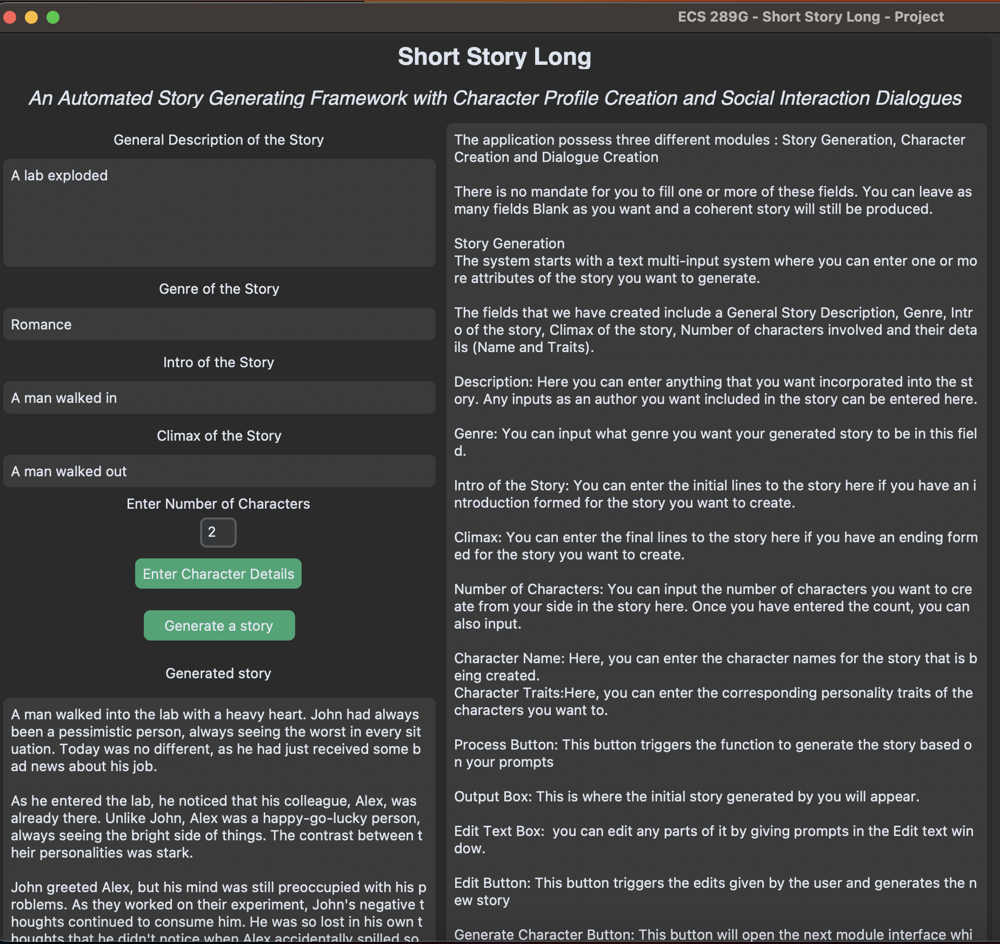

# ECS289G-project
ECS289G: Computational Storytelling using AI term project (Winter 2023)

## Welcome!
* [System and Modules](#system architecture and modules)
* [Novelty](#novelty)
* [Usage](#usage)
* [Demo](#demo)


# Short Story Long

<strong>Short Story Long</strong> is an automated Story generating framework with Character Profile Creator and Social interaction Dialogue Generator.

## System Architecture and Modules


<ul>
<li> <strong>Adaptable Author Input Module</strong></li>
<p> A text multi-input system allows author to enter multiple attributes like genre, start of story, characters and their traits, etc to accomodate unique and creative thinking methods of different authors.</p>
<li><strong> Story generator Module</strong></li>
<p> The inputs fed by the user is provided as an input to GPT module which generates the initial story.</p>
<li> <strong>Dynamic Story Regeneration Editor</strong></li>
<p> An option to edit the initial input leads to dynamic story regenration while still maintaing the crux of storyline.</p>
<li><strong> Character Profile Creator</strong></li>
<p> Profile creation based on the generated story will display character's name, age, traits and backstory. </p>
<li><strong> Character Visualizer</strong></li>
<p> Character Traits along with generated story is used as an input to GAN which results in chracter visualized as an image</p>
<li> <strong>In-Game Dialogue Generator and Editor</strong></li>
<p> Multiple optional attributes like number of characters, genre, location and expected social outcome are accomodated to  develop an in-game dialogue scene which may be edited and regenrated based on author's liking.
</ul>

## Novelity
 
Our project provides a complete integrated framework that can assist any author regardless of their thinking process in most idea generation or brainstorming processes involved for creating a game’s storyline, characters, appearances, in-game dialogues etc. This helps accommodate authors of different thinking characteristics on a single automated platform to help in story generation, character profile creation.


## Usage

To run ShortSL on your machine please run the below commands in the same order:

```bash
git clone https://github.com/rohis06/ECS289G-project.git
```

```bash
cd ECS289G-project
```
To use this repository, you need `requirements.txt` installed. You can install it using the below command. 
```bash
pip install -r requirements.txt
```
Make sure that you have the latest version of pip by running:
```bash
pip install --upgrade pip
```

```bash
cd tkinter
```
Finally, run the Tkinter application using the below command.
```bash
python story_gen.py
```

## Demo

You can get an idea of the kind of story / dialougue conversation generated by ShortSL by checking the files in `sample_output` folder.
<ul>
<li><strong>story.txt</strong> : This has a sample story being generated by ShortSL.</li>
<li><strong>dialogue.txt</strong> : This has a sample dialogue conversation being generated by ShortSL.</li>
<li><strong>char_Alex.txt and char_John.txt</strong> : These files show the kind of character profiles dynamically generated by ShortSL.</li>
</ul>





## Contributing

Pull requests are welcome. For major changes, please open an issue first to discuss what you would like to change.
